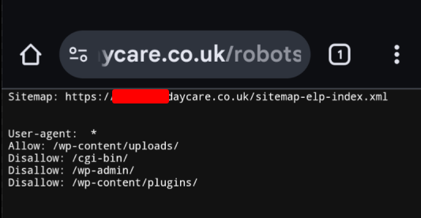
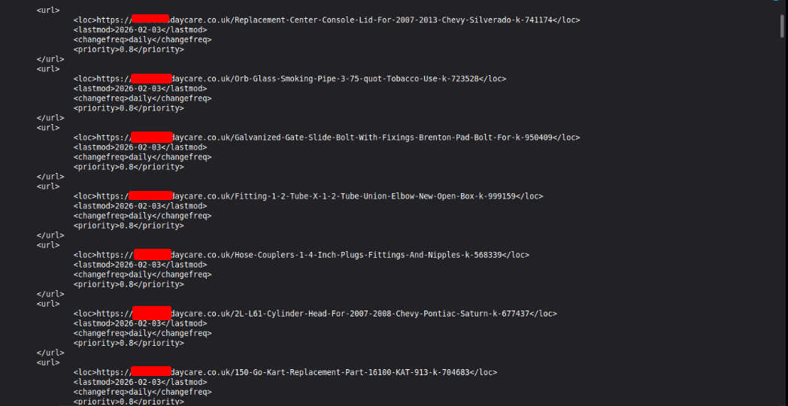
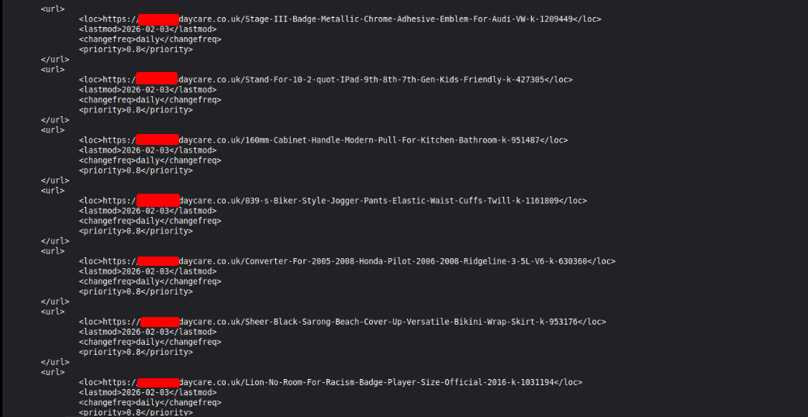

````md
# Passive OSINT Case Study: Identifying SEO Spam Injection on a WordPress Website (Responsible Disclosure)

## Executive Summary
While searching Google for laptop RAM, I noticed an unusual search result showing a daycare-related website appearing to host product listings for computer hardware. This anomaly suggested potential compromise and misuse of the domain for spam content.

Using **passive verification only** (public files and HTTP requests), I confirmed the site was publishing large numbers of unrelated “product listing” URLs via an additional sitemap system consistent with **SEO spam / parasite pages**.

> **Note:** Identifying details have been redacted to avoid amplifying harm. Evidence was shared privately with the site owner for remediation.

---

## Initial Indicator (Google Search Result)
A Google search result displayed a product-style listing on a daycare-related domain. This appeared unrelated to the organisation’s purpose and was the first sign something was wrong.


---

## Redirect Destination (Suspicious Storefront)
When clicking through from the search result, I was redirected to a suspicious e-commerce storefront advertising the same hardware at unusually low prices.


---

## Scope & Ethics
This investigation was kept strictly passive.

### ✅ Actions performed
- Viewed publicly accessible pages/files
- Reviewed `robots.txt` and sitemap XML content
- Used `curl` to fetch public content and HTTP headers

### ❌ Actions not performed
- No scanning (`nmap`, `wpscan`, `gobuster`, etc.)
- No brute forcing
- No exploitation attempts
- No interaction with any checkout/payment pages

---

## Passive Validation Steps

### 1) `robots.txt` and sitemap discovery
I checked the site’s `robots.txt` file and noticed it referenced a sitemap index containing `-elp-`, which appeared suspicious.



---

### 2) Confirm the suspicious sitemap index exists
I confirmed the suspicious sitemap index was accessible and live.

```bash
curl -I https://[redacted]/sitemap-elp-index.xml
```

I then pulled the sitemap index contents to review its structure.

```bash
curl -s https://[redacted]/sitemap-elp-index.xml | head -n 60
```


---

### 3) Inspect a daily sitemap and validate spam URL patterns
The daily sitemap contained large numbers of unrelated product-style URLs (car parts, tools, electronics, household items, etc.) that were clearly not related to a daycare.





---

## Findings / Conclusion
Based on the evidence collected, the website appears to be compromised and is being used for:

- **SEO spam injection / parasite pages**
- Search engine poisoning (spam URLs being indexed)
- Potential unsafe redirects to suspicious external storefronts

The presence of an active `sitemap-elp-index.xml` with daily spam URL lists is not consistent with a legitimate daycare website.

---

## Potential Impact
Even if the attacker’s goal is “only SEO spam”, this type of compromise can lead to:

- Unsafe redirects affecting visitors
- Google “hacked site” warnings
- Reputational damage
- Persistent attacker access if backdoors remain

---

## Responsible Disclosure
I collected evidence (screenshots and command output) and contacted the site owner to advise they contact their website developer and/or hosting provider to investigate and remediate the compromise.

No further action was taken beyond responsible reporting.

✅ End of report.
````
